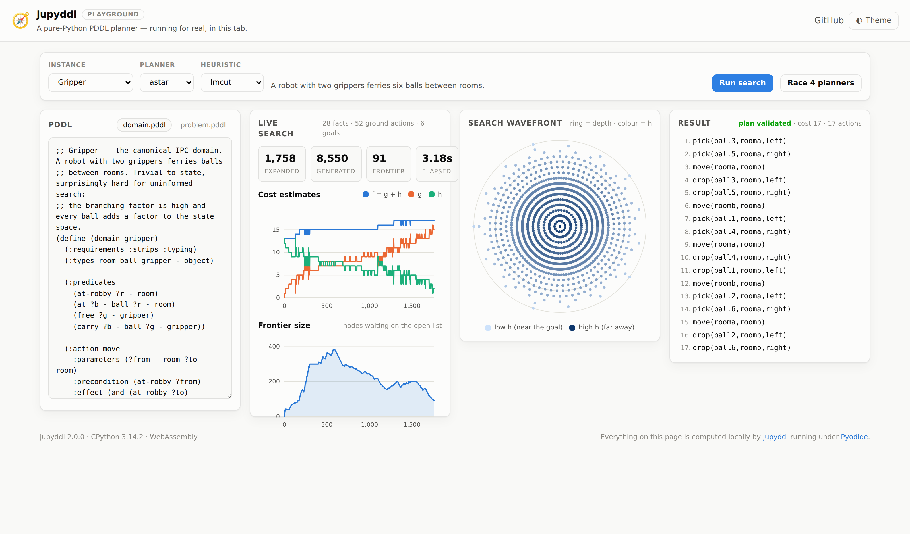

<div align="center">

# jupyddl — Python PDDL

✨ A dependency-free, pure-Python PDDL planning framework: parser, grounder,
classical-to-SOTA planners, heuristics, benchmarking — and a search you can
actually *watch*. ✨

**[▶ Open the playground](https://apla-toolbox.github.io/PythonPDDL/)** ·
[Watch the 75-second tour](promo/jupyddl-promo.mp4)

</div>

<div align="center">


[](./LICENSE)

</div>

`jupyddl` started life as a university project: a thin Python wrapper around the
Julia `PDDL.jl` parser, with a `requirements.txt` that pulled in a whole second
language runtime. It has since been **rewritten from scratch as a pure-Python
framework** — no Julia, no native dependencies, just the standard library — so it
is trivial to install, embed, teach with, and build on.

<div align="center">

<picture>
  <source media="(prefers-color-scheme: dark)" srcset="docs/images/comparison-dark.png">
  
</picture>

</div>

## Features 🌱

- 🧩 **Hand-written PDDL parser** and grounder (typing, negative preconditions,
  equality, action costs, and `forall`/`when` conditional effects).
- 🔎 **Uninformed planners**: BFS, DFS, Iterative Deepening.
- 🧭 **Informed planners**: Dijkstra (uniform cost), Greedy Best-First, A*,
  Weighted A*, IDA*, and Enforced Hill Climbing (FF-style).
- 📊 **Heuristics from classical to SOTA**: blind, goal-count, `h_max`, `h_add`,
  FF (`h_ff`), critical-path `h^m` (`h1`/`h2`), and **LM-cut**.
- 🎥 **Watch the search happen**: an observer hook on every planner feeds
  recorded traces, publication-ready charts, animations, and a live terminal
  dashboard that needs *no dependencies at all*.
- 🌐 **A browser playground** that runs this exact library under Pyodide —
  edit PDDL, pick a planner, watch it search. Nothing is uploaded.
- ⚖️ **Benchmarking harness** for comparative analysis with CSV export and a
  full dashboard.
- 🧱 **Extensible by design**: planners and heuristics live behind simple
  registries; add your own in a few lines.
- ✅ **Zero runtime dependencies** and a comprehensive test suite.

## Install 💾

Requires Python ≥ 3.9. Using [uv](https://docs.astral.sh/uv/) (recommended):

```bash
uv venv
uv pip install -e ".[dev,viz]"   # 'viz' pulls matplotlib for charts and animations
```

or with plain pip:

```bash
python -m pip install -e ".[dev,viz]"
```

The core framework needs nothing but the standard library — the `viz` extra is
only for the matplotlib charts.

## Command line ⚔️

```bash
# Solve a single instance
jupyddl solve demos/hanoi/domain.pddl demos/hanoi/problem.pddl \
    --search astar --heuristic lmcut

# Watch it search, live, in your terminal (no dependencies needed)
jupyddl solve demos/gripper/domain.pddl demos/gripper/problem.pddl --live

# Record the search and draw it
jupyddl solve demos/gripper/domain.pddl demos/gripper/problem.pddl \
    --trace run.json --plot progress.png --tree wavefront.png

# Replay a search as a video
jupyddl animate demos/blocksworld8/domain.pddl demos/blocksworld8/problem.pddl \
    -o search.mp4 --search bfs --heuristic none

# Compare planners over a folder of <name>/{domain,problem}.pddl instances
jupyddl benchmark demos --planners bfs,dijkstra,astar,gbfs,ehc --heuristic hff \
    --csv results.csv --dashboard benchmark.png

# Render every chart for every bundled demo
jupyddl demo -o gallery --both-modes
```

### The live dashboard

`--live` repaints a compact view of the search as it runs — sparklines for the
heuristic and the `f` frontier, a frontier gauge, live counters and a node rate.
It is pure standard library (ANSI escapes and Unicode blocks), and it degrades to
a periodic one-line report when the output is not a terminal, so it is safe in CI
logs and notebooks too.

```
jupyddl · astar/lmcut · gripper-6  (28 facts, 52 ground actions)
────────────────────────────────────────────────────────────────
  h  ▆▇▇█▇▅▄▅▅▄▄▄▃▃▂▂▁▂▁▁   now 2  best 1
  f  ████████████████████   now 17
  frontier  ████████░░░░░░░░░░  201  (peak 384)
  1,522 expanded   7,482 generated   1,721 evaluated
  891 nodes/s · 1.71s
  ✔ solved · cost 17 · 17 actions · 1.77s
```

## Library usage 📑

```python
from jupyddl import solve, build_task, solve_task, trace_search, validate_plan

# One-shot solve
result = solve("demos/hanoi/domain.pddl", "demos/hanoi/problem.pddl",
               search="astar", heuristic="lmcut")
print(result.solved, result.cost, result.plan_names())

# Ground once, try several configurations
task = build_task("demos/blocksworld8/domain.pddl",
                  "demos/blocksworld8/problem.pddl")
for search, heuristic in [("astar", "lmcut"), ("gbfs", "hff"), ("bfs", None)]:
    r = solve_task(task, search, heuristic)
    assert validate_plan(task, r.plan)
    print(search, heuristic, r.cost, r.stats.expanded, "expanded")
```

### Recording and plotting a search

Every planner accepts an `observer`. `trace_search` wires up a recorder for you
and hands back a replayable `SearchTrace`:

```python
from jupyddl import build_task, trace_search
from jupyddl.viz import plot_search_progress, plot_search_tree, animate_search

task = build_task("demos/gripper/domain.pddl", "demos/gripper/problem.pddl")
result, trace = trace_search(task, "astar", "lmcut")

print(trace.summary())
trace.save("run.json")                      # portable JSON, replayable later

plot_search_progress(trace, "progress.png") # cost curves, frontier, depth, throughput
plot_search_tree(trace, "wavefront.png")    # the shape of the search itself
animate_search(trace, "search.mp4")         # replay it as a video
```

Tracing is entirely opt-in and transparent: with no observer the planners never
touch the instrumentation, so the default search path keeps its zero-overhead,
zero-dependency behaviour. (The test suite asserts that an observed search
returns exactly the same plan and statistics as an unobserved one.)

<div align="center">

<picture>
  <source media="(prefers-color-scheme: dark)" srcset="docs/images/search-progress-dark.png">
  
</picture>

</div>

The wavefront chart lays each expanded node on a ring by its depth and colours it
by its heuristic estimate, so a well-guided search reads as a narrow spike and a
blind one fills the whole disc:

<div align="center">

<picture>
  <source media="(prefers-color-scheme: dark)" srcset="docs/images/wavefront-dark.png">
  
</picture>

</div>

### Writing your own observer

`SearchObserver` hooks default to no-ops, so you override only what you need:

```python
from jupyddl import build_task, solve_task
from jupyddl.trace import SearchObserver

class StallDetector(SearchObserver):
    """Shout when the search spends too long without improving h."""

    def __init__(self, patience=500):
        self.patience, self.best, self.since = patience, float("inf"), 0

    def on_expand(self, state, h=0.0, stats=None, **kwargs):
        if h < self.best:
            self.best, self.since = h, 0
        else:
            self.since += 1
            if self.since == self.patience:
                print(f"plateau at h={self.best} after {stats.expanded} expansions")

task = build_task("demos/gripper/domain.pddl", "demos/gripper/problem.pddl")
solve_task(task, "gbfs", "hff", observer=StallDetector())
```

## The browser playground 🌐

**[apla-toolbox.github.io/PythonPDDL](https://apla-toolbox.github.io/PythonPDDL/)**

The playground runs *this library*, unmodified, compiled to WebAssembly by
[Pyodide](https://pyodide.org) — not a JavaScript re-implementation. Because the
core is stdlib-only there is no wheel to resolve: the package sources are handed
straight to the interpreter. Edit the PDDL, pick a planner and a heuristic, and
watch the cost curves and the search wavefront animate while it works; or race
four configurations against each other. Everything is computed in your tab.

<div align="center">



</div>

Build and serve it locally:

```bash
python tools/build_web.py          # bundle the package + demos into web/dist
python -m http.server -d web 8000  # then open http://localhost:8000
```

`web/dist` is committed so the page works from a plain clone; CI fails if it
drifts out of step with the sources.

## Benchmarking 📈

```bash
jupyddl benchmark demos --planners astar,gbfs,ehc,bfs --heuristic hff \
    --csv results.csv --dashboard benchmark.png
```

<div align="center">

<picture>
  <source media="(prefers-color-scheme: dark)" srcset="docs/images/benchmark-dark.png">
  
</picture>

</div>

## Demo instances 🧪

`demos/` holds six instances chosen to stress different parts of the framework —
and to make the difference between planners obvious:

| Instance | What it exercises | Optimal cost |
|---|---|---:|
| `gripper` | high branching factor, classic IPC domain | 17 |
| `blocksworld8` | deep plans and heavy plateaus | 16 |
| `hanoi` | untyped domain, exponential space, closed-form answer (2⁵−1) | 31 |
| `logistics` | type hierarchy and `:action-costs` | 24 |
| `sokoban` | static-predicate pruning, irreversible moves, dead ends | 11 |
| `elevator` | `when` conditional effects | 14 |

The `pddl-examples` git submodule supplies the smaller instances used by the
parser and grounder tests.

## Available planners & heuristics

| Planners | Heuristics |
|---|---|
| `bfs`, `dfs`, `iddfs`, `dijkstra`, `gbfs`, `astar`, `wastar`, `idastar`, `ehc` | `blind`, `goalcount`, `hmax`, `hadd`, `hff`, `h1`, `h2`/`hm`, `lmcut` |

`A*`/`IDA*` are cost-optimal with an admissible heuristic (`blind`, `hmax`,
`h1`/`h2`, `lmcut`); `dijkstra` and `bfs` are optimal without a heuristic.

## Supported PDDL subset

STRIPS, `:typing` (with hierarchy), `:negative-preconditions`, `:equality`,
`:action-costs` (`(increase (total-cost) k)`), universally-quantified goals, and
`forall`/`when` conditional effects. Numeric fluents beyond `total-cost` and
`:durative-action`s are out of scope and rejected with a clear error.

> **Note:** on domains with conditional effects (e.g. `flip`, `elevator`), the
> delete-relaxation heuristics (`hadd`, `hff`, `lmcut`, `h^m`) are *satisficing*
> only — admissibility is not guaranteed. Use `bfs`, `dijkstra`, or
> `astar`/`idastar` with `blind` for guaranteed-optimal plans on such domains.

## Architecture 🏗️

```
jupyddl/
  parser/       tokenizer + AST + recursive-descent parser
  grounding.py  Domain+Problem -> grounded Task (typing, PNF, static pruning)
  task.py       grounded STRIPS(+conditional-effects) task & operators
  search/       planners + shared best-first engine + registry
  heuristics/   heuristics + delete-relaxation machinery + registry
  trace.py      search observers, events and serialisable traces
  live.py       zero-dependency live terminal dashboard
  viz/          matplotlib theme, charts, animations (the 'viz' extra)
  benchmark.py  comparative benchmarking (CSV + plots)
  cli.py        solve / benchmark / animate / demo
web/            the Pyodide playground
tools/          web bundler and the promo-video renderer
demos/          demo instances used by the docs, charts and video
```

Add a planner by subclassing `jupyddl.search.Planner` (or reusing `best_first`)
and registering it in `jupyddl.search.PLANNERS`; add a heuristic by subclassing
`jupyddl.heuristics.Heuristic` and registering it in
`jupyddl.heuristics.HEURISTICS`. Both are picked up by the CLI, the benchmark
harness and the playground automatically.

## Development 🛠️

```bash
git submodule update --init      # fetch the pddl-examples used by the tests
uv pip install -e ".[dev,viz]"
pytest --cov=jupyddl             # run the test suite
flake8 jupyddl tests tools       # lint
black jupyddl tests tools        # format
```

Regenerating the media:

```bash
python tools/build_web.py                      # playground bundle
python tools/make_promo.py -o promo/jupyddl-promo.mp4 \
    --screenshot promo/playground.png          # the promo video
```

Every number in the promo video is measured at render time by running the real
planners — nothing in it is typed in by hand.

## Cite 📰

```
@misc{https://doi.org/10.13140/rg.2.2.22418.89282,
  doi = {10.13140/RG.2.2.22418.89282},
  url = {http://rgdoi.net/10.13140/RG.2.2.22418.89282},
  author = {Erwin Lejeune},
  title = {Jupyddl, an extensible python library for PDDL planning and parsing},
  year = {2021}
}
```

## Maintainers Ⓜ️

- Erwin Lejeune
- Sampreet Sarkar
